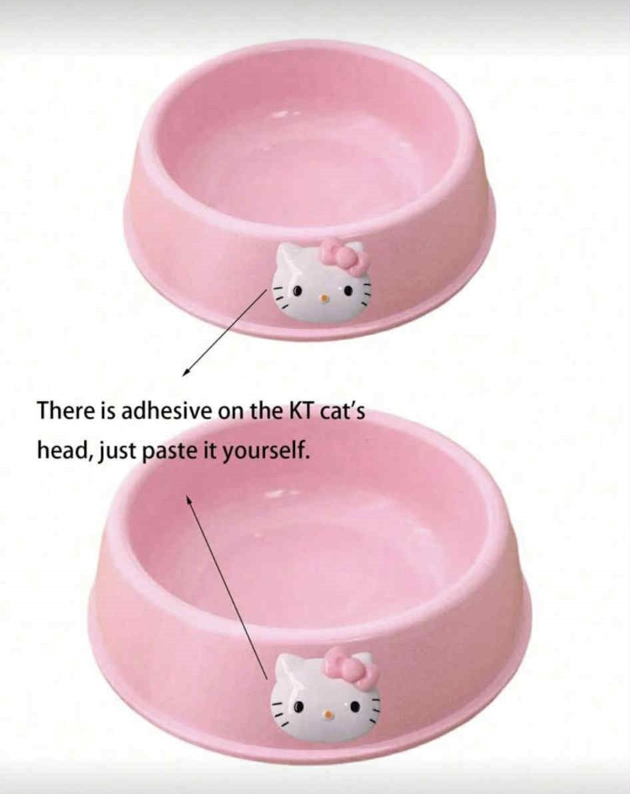
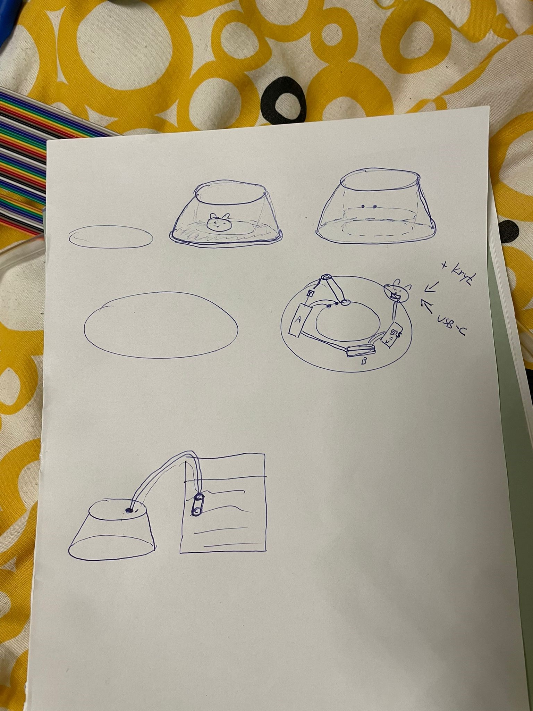
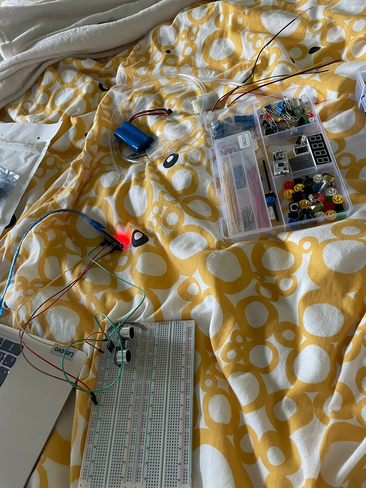
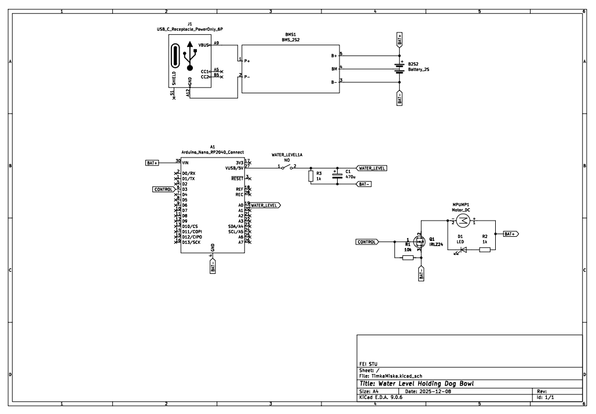
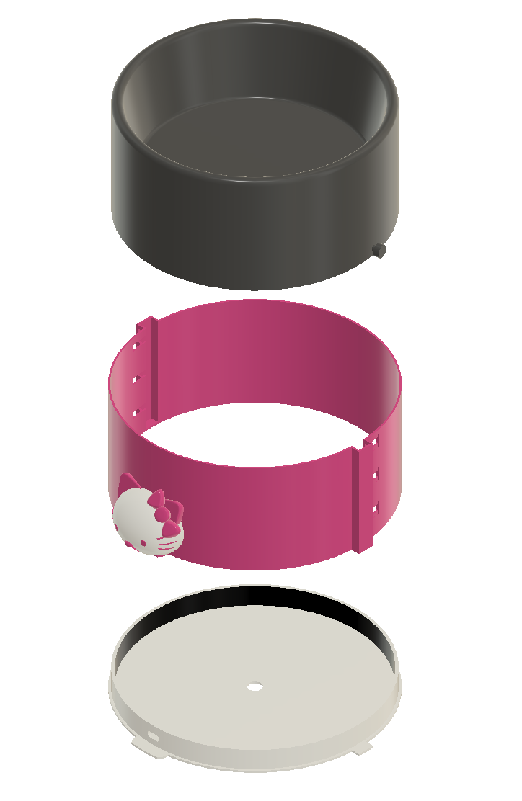
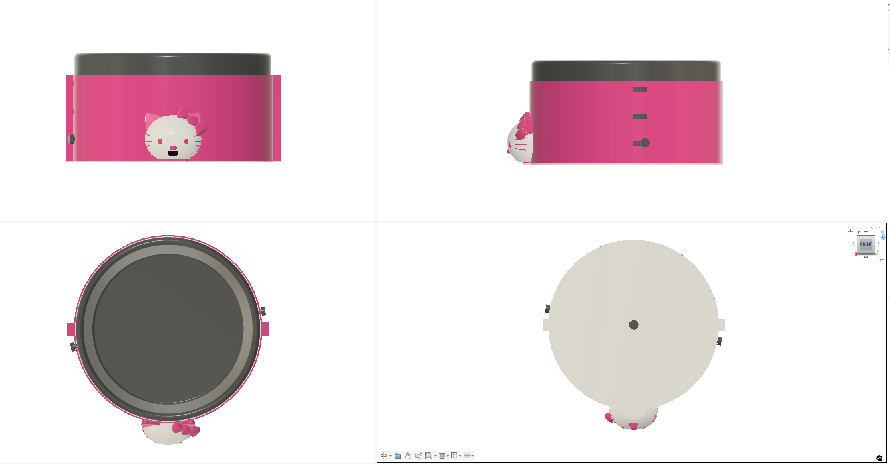
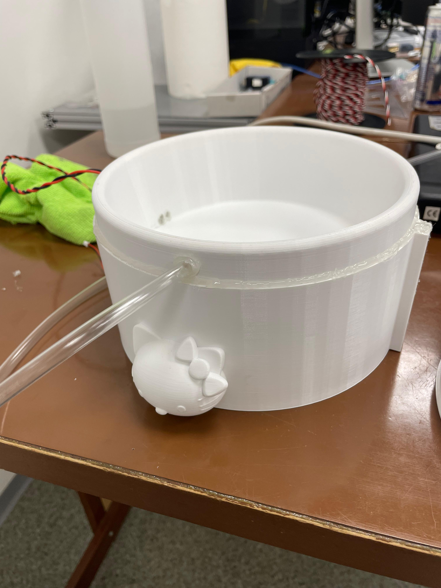

# Projekt: Automatická Miska na Vodu pre Psa

**Autor:** Timea Vrtíková
**Dátum:** 16. 12. 2025
**Verzia:** 2.0 (Finálna dokumentácia)

---

## 1. Téma Projektu
Vývoj a výroba funkčného prototypu inteligentnej misky pre psa, ktorá automaticky deteguje nízku hladinu vody a zabezpečí jej doplnenie. Projekt spája hardvér (mikrokontrolér Arduino a senzory), softvér (programovanie v C++), 3D modelovanie a 3D tlač do jedného funkčného celku.

## 2. Motivácia a Počiatočný Návrh
Primárnou motiváciou pre tento projekt bola praktická potreba mojej sestry. Chcela pre svojho psa moderné a pohodlné riešenie, ktoré by zabezpečilo, že bude mať vždy prístup k čerstvej vode. Ako vizuálna inšpirácia poslúžila ružová miska v štýle "Hello Kitty".


*Obr. 1: Požadovaný vizuálny štýl a inšpirácia pre projekt.*

Na základe tejto predstavy som začala pracovať na vlastných nákresoch, kde som rozpracovala základný tvar misky, umiestnenie elektroniky, napájania (USB-C) a princíp fungovania.


*Obr. 2 a 3: Moje vlastné počiatočné nákresy a detailnejšie rozpracovanie dizajnu.*

## 3. Ciele Projektu
Na začiatku projektu som si stanovila nasledujúce kľúčové ciele:
*   **Automatizácia:** Systém musí byť schopný samostatne detegovať pokles hladiny vody.
*   **Funkčnosť:** Po detekcii nízkej hladiny musí systém automaticky aktivovať čerpadlo na doplnenie vody.
*   **Bezpečnosť a Hygiena:** Miska musí byť vyrobená z materiálu bezpečného pre styk s potravinami (food-safe).
*   **Samostatnosť:** Zariadenie má byť napájané z batérie, aby bolo prenosné a bezpečné.

## 4. Postup Práce a Implementácia

### 4.1. Prvé Experimenty a Prototypovanie
Práca začala experimentovaním s hardvérom. Prvotný plán bol použiť ultrazvukový senzor na meranie hladiny vody. Zostavila som testovací obvod s Arduinom a senzorom na breadboarde, aby som overila jeho funkčnosť.


*Obr. 4: Testovacie prostredie – Arduino, breadboard, ultrazvukový senzor a ďalšie komponenty.*

### 4.2. Zásadný Pivot a Finálny Návrh Elektroniky
Počas testovania sa ukázal kľúčový problém: ultrazvukový senzor **nedokázal spoľahlivo merať hladinu cez stenu misky**. Preto som sa rozhodla pre radikálnu zmenu prístupu (**pivot**). Nové riešenie bolo založené na spoľahlivejšom **meraní vodivosti vody** pomocou dvoch sond. Na základe toho som navrhla finálnu a detailnú schému elektroniky.


*Obr. 5: Detailná schéma finálneho zapojenia, vrátane napájania, riadenia a senzorov.*

### 4.3. Finálny Kód
S novým hardvérovým návrhom som finalizovala aj kód pre Arduino. Kód neustále monitoruje analógový pin pripojený k sondám. Ak hodnota klesne pod prahovú úroveň (voda chýba), aktivuje pin, ktorý spína čerpadlo.

```cpp
// Definovanie pinov
constexpr int testPin = A0;      // Vstupny pin na citanie stavu vodivosti
constexpr int controlPWM = 3;    // Vystupny pin na ovladanie cerpadla

void setup() {
  pinMode(testPin, INPUT);
  pinMode(controlPWM, OUTPUT);
  Serial.begin(9600);
}

void loop() {
  static int sensorValue = 0, u = 0;
  sensorValue = analogRead(testPin);

  // Ak je hodnota nízka (pod 60), voda chýba -> aktivuj cerpadlo
  if (sensorValue < 60) {
    u = 255;
  } else {
    u = 0;
  }
  analogWrite(controlPWM, u);
  delay(500);
}
```
### 4.4. 3D Modelovanie a Príprava na Tlač
Na základe nákresov a finálnych rozmerov elektroniky som vytvorila detailný 3D model misky. Model sa skladá z troch častí: vnútornej misky, vonkajšieho dekoratívneho plášťa a spodného krytu, ktorý chráni elektroniku.


*Obr. 6: Explodovaný pohľad na jednotlivé časti 3D modelu.*


*Obr. 7: Finálny 3D model z rôznych uhlov pohľadu pripravený na 3D tlač.*

### 4.5. Výsledný Produkt
Po vytlačení všetkých častí a finálnej montáži elektroniky vznikol plne funkčný prototyp, ktorý spĺňa všetky pôvodné požiadavky.


*Obr. 8: Finálny produkt – funkčná automatická miska pripravená na použitie. (Sem vlož fotku reálneho produktu)*

## 5. Záver a Získané Skúsenosti
Projekt úspešne splnil všetky stanovené ciele. Počas práce som si osvojila širokú škálu zručností – od návrhu elektronických obvodov, cez programovanie mikrokontrolérov, až po 3D modelovanie a tlač. Najdôležitejším poznatkom bola dôležitosť flexibility a schopnosti urobiť "pivot", keď sa pôvodný plán ukáže ako nefunkčný.
